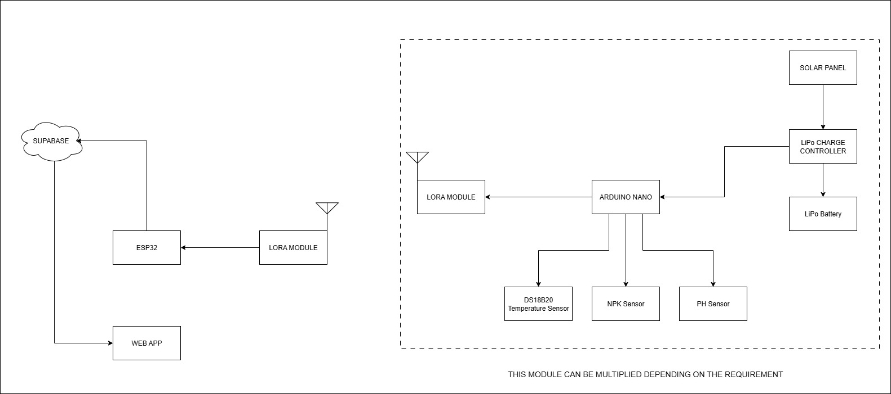

# AGRIna: Smart Soil Analyzer for Rice Crops

## Overview

AGRIna is a portable Arduino & LoRa-based smart soil analyzer designed to help the Department of Agriculture obtain real-time soil condition data directly from the field. By measuring key soil parameters—nitrogen (N), phosphorus (P), and potassium (K) in parts per million (ppm), pH (0–14 scale), and temperature (°C)—AGRIna accelerates decision-making for rice crop management. Data are wirelessly transmitted via LoRa to an ESP32, which forwards readings to a web application featuring live dashboards, historical logs, and simple soil health recommendations.

## Block Diagram



## Features

- **Real-time Sensing**: NPK (ppm), pH (0–14), and temperature (°C)
- **Multi-Module Support**: Up to three simultaneous sensor modules for comparative field analysis
- **Wireless Transmission**: LoRa communication between Arduino nanos and ESP32
- **Web Dashboard**: Live readings, interactive graphs, historical data logs
- **Automated Recommendations**: Simple fertilizer and soil amendment suggestions based on sensor results
- **Power Options**: LiPo battery with charge controller and optional solar panel support

## Hardware Requirements

- **Sensor Module (×3)**
  - Arduino Nano
  - LoRa transceiver
  - DS18B20 temperature sensor
  - NPK soil sensor
  - pH sensor
  - LiPo battery, LiPo charge controller, and solar panel (optional)
- **Central Hub**
  - ESP32 development board
  - LoRa transceiver

## Software Requirements

- Arduino IDE (or PlatformIO) for Nano firmware
- ESP32 toolchain for central hub firmware
- Node.js & npm for web application
- Supabase account (for database and hosting)

## Installation

1. **Clone the repository**

   ```bash
   git clone <repo-url>
   cd AGRIna
   ```

2. **Prepare the Sensor Module**

   - Place `AGRIna_BlockDiagram.jpg` in the project root.
   - Open `sensor_module.ino` in Arduino IDE.
   - Select **Arduino Nano** and upload the sketch.

3. **Flash the ESP32 Hub**

   - Open `hub_firmware.ino` (or PlatformIO project) in your IDE.
   - Select **ESP32** board and upload.

4. **Set Up the Web App**
   ```bash
   cd web-app
   npm install
   npm start
   ```
   - Configure your Supabase URL and anon key in `web-app/.env`.

## Usage

1. Power on each sensor module (via LiPo battery or solar).
2. Modules collect soil data and transmit via LoRa.
3. ESP32 receives, then pushes data to the Supabase backend.
4. Open the web dashboard in your browser to view live data, graphs, and recommendations.

## Contributing

Contributions are welcome! Please fork the repo, create a feature branch, and submit a pull request. For major changes, open an issue first to discuss your ideas.

## License

This project is licensed under the MIT License. See [LICENSE](LICENSE) for details.
